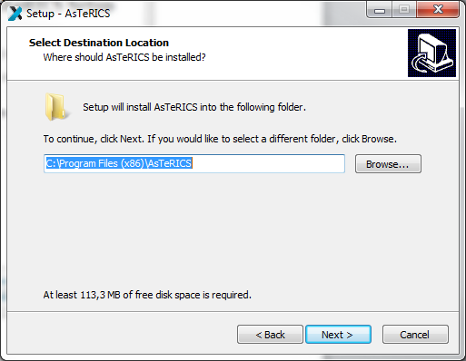
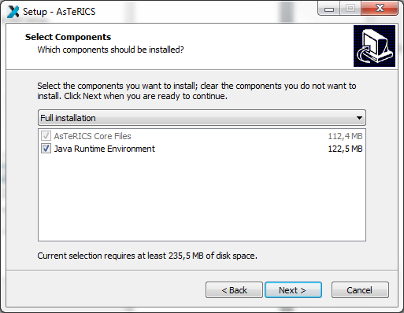
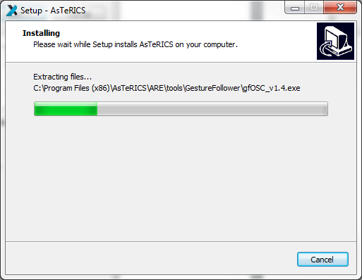
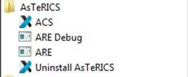
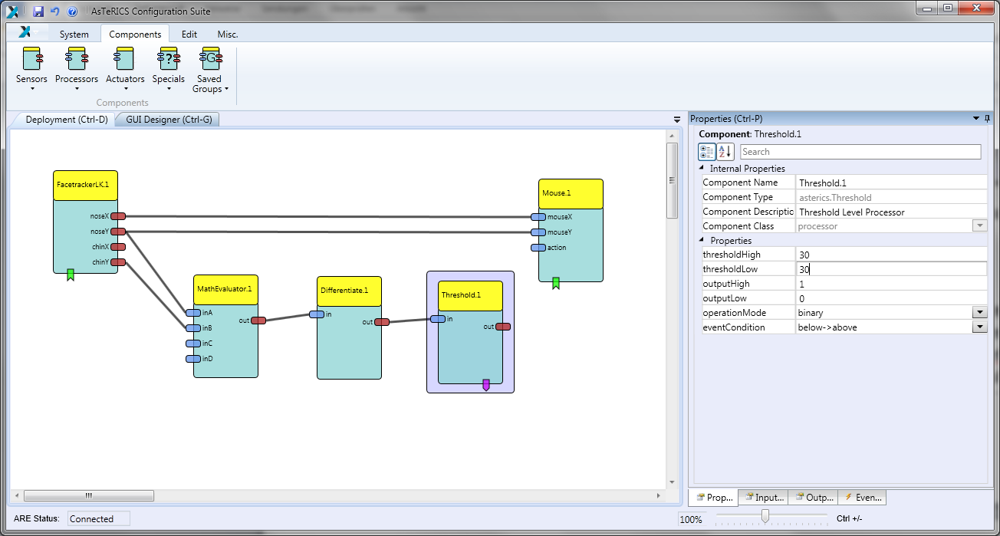

# Schnellstartanleitung

## Generelle Information

These instructions will help you to install the open-source-software AsTeRICS. The
installation process will be described step-by-step.

## AsTeRICS

"Assistive Technology Rapid Integration and Construction Set".
With AsTeRICS, you can easily and economically build, use and adapt your efficient
and individual "Assistive Technologies". The input capabilities of AsTeRICS are very
flexible. AsTeRICS can be used and combined with different input-devices such as a
webcam, switches or an on-screen scanning keyboard.
The various output-capabilities of the system include PC device emulation, game
control, environmental control applications and utilization of embedded devices.

## ACS

AsTeRICS Configuration Suite is a graphical editor for easy building and adapting
"Assistive Technologies".
For this purpose you use sensors, actuators and processors, which are included in
the software. You can connect these elements and build your own individual setup
(also called a "model"), which is specially adapted for your needs, easily and fast.

## ARE

The AsTeRICS Runtime Environment is the basic software framework for all
AsTeRICS applications and use-cases. The models built in the ACS will run in the
ARE. The ACS can be seen as a configuration program for the ARE.

## Required devices and conditions

* AsTeRICS hardware platform (cf. [here](ht../tp://asterics.harpo.com.pl/hardware.html))
  or a PC / notebook with Windows XP / VISTA / 7 or later
* Internet access

# Installation

The AsTeRICS provides installer for Windows, Linux and Mac OSX, but only on
Windows the full AsTeRICS suite is supported. On the other platforms the installer
only contains the ARE. For detailed platform-specific installation instructions, please
refer to the release documentation.
The following steps describe how the AsTeRICS software framework can be installed
on a PC with Windows operating system.
Download the AsTeRICS setup executable from the github releases section.

## Start the installation

Start the setup file.
You should see the welcome window. It informs you which version of the software
you are installing. Click the button **Next**.

<!-- 

  

 -->

## Define the installation path

In this dialogue window you can define the installation path that means you can
choose a folder, where Asterics should be installed. We suggest using the standard
installation path. Then Click the button **Next**.

## Select components

You can see the component selection window:

AsTeRICS needs the Java Runtime Environment (`>= Version 7, 32-Bit Version`). If
you have already installed the Java Runtime Environment on your computer, please
deselect this option and install only AsTeRICS. (*Note*: The 32-bit version of the JRE
is recommended, because some plugins only work in 32-bit mode.

Then, click the button **Next**.

## Installation

Define Start Menu folder entry
In the next dialogue window you can define the name of the start menu entry.You
can see the following window:

Then, click the button **Next**.

## Progress of installation

In the next dialogue window you can see the progress of the installation. It can take a
few minutes until the process is finished:

## Instruction for installation

Installation finish
You can see the following window:

Click the button **Finish**.
You have successfully installed AsTeRICS.

## Complete (check) the installation

### Desktop Short Cuts

On your desktop you will find the following links (short cuts):

These short cuts can be used to start ACS and ARE. Alternaively, you can start these
programs also from the Windows start menu, where additional liks to the Debug
version of the ARE (which displays debugging information in a console window) and
the AsTeRICS unistaller have been added:

### Programs in the Start Menu

Under Windows-start **All Programs** you will find the start folder **AsTeRICS** and
the start-files.

## Creating Models – a first Example

A model is a collection of 1 to n components, where a component represents a plugin
of the ARE. These components are connected via cannels (for data connections) and
event channels (representing events). The following example will illustrate the
creation of a simple webcam mouse, using the position of the nose to control the
cursor and opening the mouth to trigger a mouse click. This model requires a
connected and installed webcam.

In a first step, start the ACS and the ARE using the ACS.exe and ARE.exe short cuts.
In the ACS window select the tab **Components**, then **Sensors** and within the
sensors the menu item **Computer Vision**. There select the component
FacetrackerLK. The component is now on the drawing area and, if the component is
selected, properties can be set (or changed) in the rightmost part of the ACS window.

The next needed component is the **Mouse**, it can be found by selecting **Actuators** -
**Input Device Emulation**. After the insert, select the Mouse component and adapt
the properties. Deactivate absolutePosition and set the `xMax` and `yMax` to your
screen resolution.

In the next step, connect the noseX and the noseY outputs of the **FacetrackerLKd**
with the mouseX and mouseY inputs of the Mouse. Finally, it should look like the
screenshot below.

The model now would be able to use the coordinates of the nose to control the
mouse cursor, but the mouse click is still missing.
For the mouse clicking functionality, we first need the **MathEvaluatord** (**Processorsd** -
**Basic Mathd**) plugin. We connect the noseY output of the **FacetrackerLKd** the with
the inA input of the **MathEvaluatord** and likewise the chinY with inB. In the properties
of the **MathEvaluatord**, we set the property expression to **b-ad**.

We will **Differentiate** (**Processorsd** -> **Basic Mathd**) the out value to react on a fast
change of the nose to chin distance.

This processed value will then be forwarded to a **Threshold** (**Processors** -> **Basic
Math**) component. Set the thresholdLow and thresholdHigh values to 30.

As a final step, connect the event trigger output of the **Threshold** with the event
listener input of the **Mouse** – the event triggers and listeners are at the bottom of the
components. After the connection has been made, set the leftClick to eventPosEdge
in the property editor at the right. If everything was done right, it should look like the
following screenshot:

Now, upload the model to the ARE and press the **Start Model** button. A window with
the camera screen will appear, marking with a green and yellow circle - the position
of nose and chin. Press the **Stop Model** button or press F7 to stop the model and
get the control of the mouse back. Below is a screenshot of the system, when
running.

Congratulations, your first AsTeRICS model is running!

## Reducing Tremor

You might have noticed that the mouse pointer has a tremor, because the head is
always in movement to a certain extent. To reduce this tremor, an **Averager**
(**Processors** -> **Basic Math**) will be used to smoothen the X coordinates and
another **Averager** for the Y coordinates between the **FacetrackerLK** and the
**Mouse**. The bufferSize in the properties will be set to 5.

That's all, just upload the model and start it now.

## Adjusting the Webcam

If you don't like the position of the webcam after starting the model, you can set a
different start position. Select the **GUI Designer** tab above the drawing area and
move the webcam window to an area, which is comfortable to you. Also the size of
the window can be adjusted.

Upload and start the model to work with the changes.

> For more examples and detailed descriptions of the features of ACS and ARE,
> please refer to the AsTeRICS user manual!
